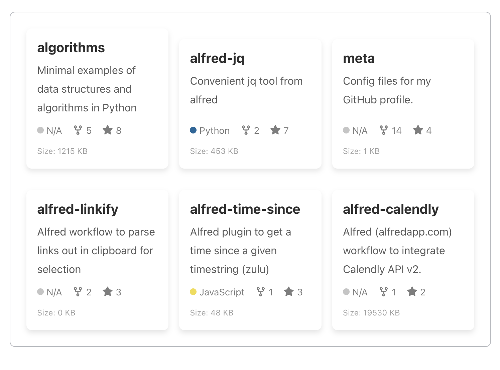

# RepoWidget

[](https://github.com/peterbenoit/RepoWidget)
[](https://github.com/peterbenoit/RepoWidget/blob/main/LICENSE)
[](https://repowidget.vercel.app/)

A professional GitHub repository display widget for showcasing repositories on any website. RepoWidget makes it easy to embed and display GitHub repositories in a customizable, responsive layout without any dependencies.



## Features

-   🔍 Display repositories from any GitHub user or organization
-   🎨 Fully customizable styling and appearance
-   📱 Responsive design with configurable column layouts
-   ⚡ Zero dependencies, lightweight and fast
-   🔄 Sort repositories by stars, forks, or last update date
-   🧩 Simple integration with any website
-   🌐 Works with vanilla JavaScript or any framework

## Demo & Examples

Visit our [demo page](https://repowidget.vercel.app/) to see RepoWidget in action.

### Example Use Cases

-   [Company Open Source Page](https://repowidget.vercel.app/examples/company.html) - Showcase your company's open source projects
-   [Documentation Hub](https://repowidget.vercel.app/examples/documentation-hub.html) - Display relevant repositories in documentation
-   [Developer Portfolio](https://repowidget.vercel.app/examples/portfolio.html) - Highlight your personal projects

## Quick Start

### Option 1: Direct Script Include

```html
<div id="my-github-repos"></div>

<script src="https://repowidget.vercel.app/assets/js/repoWidget.min.js"></script>
<script>
    createRepoWidget({
        username: 'your-github-username',
        containerId: 'my-github-repos',
        maxRepos: 6,
    });
</script>
```

### Option 2: NPM Installation

```bash
npm install repo-widget
```

```javascript
import { createRepoWidget } from 'repo-widget';

createRepoWidget({
    username: 'your-github-username',
    containerId: 'my-github-repos',
    maxRepos: 6,
});
```

## Configuration Options

RepoWidget is highly customizable. Here's a complete example with all available options:

```javascript
createRepoWidget({
    // Required
    username: 'github-username', // GitHub username or organization name
    containerId: 'repos-container', // ID of the container element

    // Optional
    maxRepos: 6, // Maximum number of repositories to display
    exclude: ['excluded-repo-1', 'excluded-repo-2'], // Repositories to exclude
    sortBy: 'stars', // Sort repos by: "stars", "forks", or "updated"
    forked: false, // Whether to include forked repositories
    noStyles: false, // Set to true to disable default styles

    // Responsive column layout
    columns: {
        mobile: 1, // Columns on mobile (<768px)
        tablet: 2, // Columns on tablet (768px-1023px)
        desktop: 3, // Columns on desktop (>1024px)
    },

    // Custom styles
    cardStyles: {
        backgroundColor: '#ffffff',
        borderRadius: '8px',
        boxShadow: '0 2px 6px rgba(0, 0, 0, 0.1)',
        border: '1px solid #e1e4e8',
        margin: '10px',
        padding: '20px',
        height: '100%',
    },

    textStyles: {
        titleSize: '18px',
        titleColor: '#0366d6',
        titleWeight: '600',
        descriptionColor: '#586069',
        descriptionSize: '14px',
        iconColor: '#586069',
    },

    // Animation
    scaleOnHover: 1.03, // Scale factor on hover (set to null to disable)

    // Callbacks
    onLoad: function (repos) {
        console.log('Repositories loaded:', repos);
    },
    onError: function (error) {
        console.error('Error loading repositories:', error);
    },
});
```

## API Reference

For complete API documentation, visit our [API Reference](https://repowidget.vercel.app/api.html).

## Using with GitHub API Token (for higher rate limits)

If you need to display many repositories or need higher rate limits, you can use a GitHub API token:

```javascript
createRepoWidget({
    username: 'your-github-username',
    containerId: 'repos-container',
    githubApiToken: 'your-github-token', // Consider using environment variables
});
```

Note: Only use GitHub tokens in secure contexts and be careful not to expose them in client-side code. Consider using a proxy server for production applications.

## Browser Support

RepoWidget works in all modern browsers:

-   Chrome (latest)
-   Firefox (latest)
-   Safari (latest)
-   Edge (latest)

## Contributing

Contributions are welcome! Feel free to open issues or submit pull requests.

1. Fork the repository
2. Create your feature branch (`git checkout -b feature/amazing-feature`)
3. Commit your changes (`git commit -m 'Add some amazing feature'`)
4. Push to the branch (`git push origin feature/amazing-feature`)
5. Open a Pull Request

## Development

```bash
# Install dependencies
npm install

# Start development server
npm run dev

# Build for production
npm run build
```

## License

This project is licensed under the MIT License - see the LICENSE file for details.

## Contact

Peter Benoit - [GitHub Profile](https://github.com/peterbenoit)

Project Link: [https://github.com/peterbenoit/RepoWidget](https://github.com/peterbenoit/RepoWidget)
